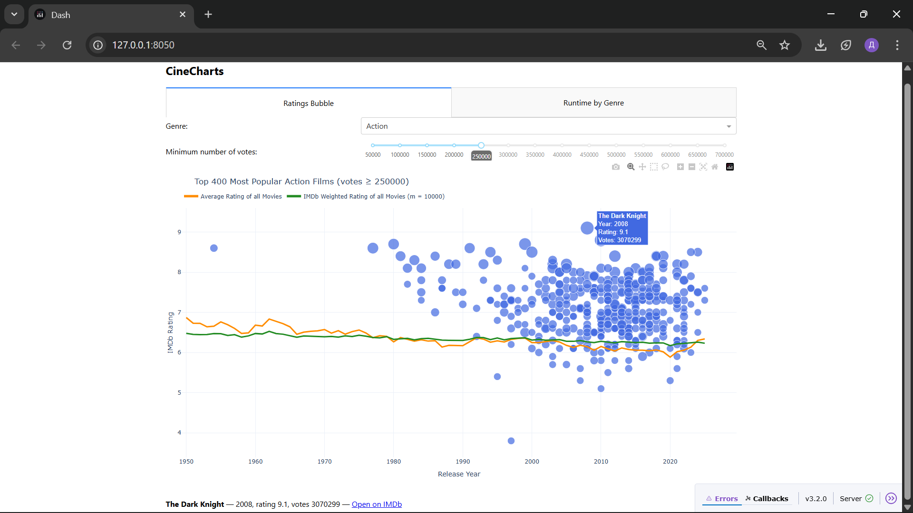
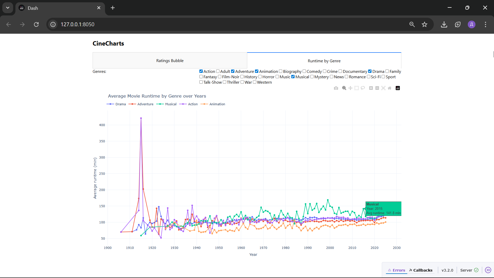

# CineCharts
CineCharts is a data visualization project built with [IMDb public datasets](https://datasets.imdbws.com/).
It provides interactive and dynamic charts about movies, using mainly Dash and Plotly.

# Motivation
I really love and enjoy cinema, so I chose movies as the theme for this project. At the same time, it allowed me to explore large open datasets and practice building interactive visualizations with Dash and Plotly. CineCharts combines my interest in films with learning modern data science tools.

# Project Overview
The project reads IMDb datasets (currently title.basics and title.ratings, which can always be downloaded from the official IMDb link above) and uses them to create dynamic interactive charts. Data cleaning and preprocessing are handled with pandas and NumPy, while the visualizations are built with Dash and Plotly. The charts allow exploring relationships between movie ratings, popularity, durations and genres through the years.

   
   

